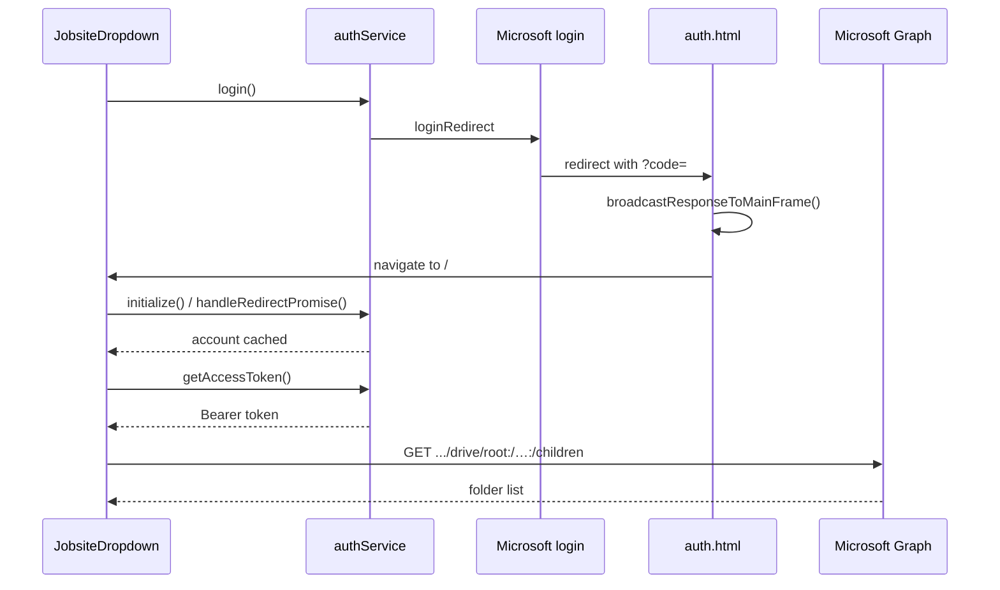

# Authentication & OneDrive Jobsites — How It Works

This app signs users in with **MSAL** (Microsoft Authentication Library), completes the login on a dedicated redirect page, then uses **Microsoft Graph** to list OneDrive folders in `JobsiteDropdown`.

MSAL only handles authentication (who the user is + access tokens).  
OneDrive/file operations are separate Graph HTTP calls that use those tokens.

---

## Architecture

| Layer | Files | Role |
|---|---|---|
| **Auth service** | `src/authService.js`, `src/msal-config.jsx` | Sign-in/out and access tokens |
| **Redirect bridge** | `auth.html`, `src/auth-redirect.js` | Catch Microsoft’s reply and hand it back to the app |
| **Jobsites UI** | `src/jobsite-dropdown.jsx` | Sign-in button + list/select OneDrive folders |



---

## 1. `authService` — authentication API

**What it is:** A singleton wrapper around MSAL’s `PublicClientApplication`.

Every module imports the same instance:

```js
import { authService } from "./authService.js";
```

### Methods

| Method | Purpose |
|---|---|
| `initialize()` | Call **once** at app start (see `main.jsx`). Boots MSAL, finishes any pending redirect login, sets the active account. Returns the PCA for `<MsalProvider>`. |
| `login()` | Starts interactive sign-in via full-page `loginRedirect` (browser leaves this tab). |
| `logout()` | Signs out via redirect and clears the local MSAL session. |
| `getAccessToken(scopes?)` | Returns a Graph Bearer token. Tries silent first; redirects if consent/reauth is required. Returns `null` if a redirect was started. |
| `getAccount()` | Currently signed-in account, or `null`. |
| `isAuthenticated()` | `true` when at least one account is in the MSAL cache. |
| `getInstance()` | Raw MSAL client — pass into `<MsalProvider instance={…}>`. |

### Typical usage before any Graph call

```js
const token = await authService.getAccessToken();
if (!token) return; // redirect in progress — stop this request

const res = await fetch("https://graph.microsoft.com/v1.0/me", {
  headers: { Authorization: `Bearer ${token}` },
});
```

### Config (`src/msal-config.jsx`)

| Setting | Meaning |
|---|---|
| `clientId` | Entra app (client) ID |
| `authority` | Usually `https://login.microsoftonline.com/common` or your tenant ID |
| `redirectUri` | Must match Entra **exactly** (this app: `http://localhost:5173/auth.html`) |
| `postLogoutRedirectUri` | Where logout returns (same SPA URI in this project) |
| `loginRequest.scopes` | Delegated Graph scopes, e.g. `User.Read`, `Files.ReadWrite` |
| `graphConfig.jobsitesFolderPath` | OneDrive folder that contains jobsite subfolders (`"project"`, `"Documents/Jobs"`, or `""` for root) |

### Login lifecycle

1. `main.jsx` calls `await authService.initialize()` before rendering.
2. UI calls `authService.login()` when the user is signed out.
3. Microsoft redirects to `/auth.html` with an auth code.
4. Redirect bridge caches the response and sends the browser to `/`.
5. On the next boot, `initialize()` → `handleRedirectPromise()` completes login and stores the account in `localStorage`.
6. Components call `getAccessToken()` before Graph requests.

---

## 2. `auth-redirect` — landing pad after Microsoft login

**Files:** `auth.html` + `src/auth-redirect.js`

**Why it exists:** Entra is registered with SPA redirect URI `http://localhost:5173/auth.html`. After sign-in, Microsoft **must** return there — not to the main React app.

**What it does:**

1. Detects whether the URL has an OAuth payload (`code`, `error`, etc.).
2. If **yes** → calls `broadcastResponseToMainFrame()` from `@azure/msal-browser/redirect-bridge`.
3. For `loginRedirect`, the bridge caches the response and navigates to the main app (`/`).
4. The main app’s `handleRedirectPromise()` then finishes token exchange.
5. If **no** auth payload (logout landing or direct visit) → redirect home immediately.

**Rules:**

- Keep this page lightweight — do **not** mount the full React app here.
- Do not call `handleRedirectPromise()` yourself on this page; use the redirect-bridge helper.
- Debug lines log param **names** and short value previews only (not full auth codes).

---

## 3. `JobsiteDropdown` — UI + OneDrive listing

**File:** `src/jobsite-dropdown.jsx`

**Responsibilities:**

1. Show **Sign in with Microsoft** when logged out.
2. After login, load folder names from OneDrive via Graph.
3. Let the user pick a folder; optionally notify a parent via `onFolderSelect(name)`.

### Auth vs data

| Concern | Source |
|---|---|
| Signed-in state | `@azure/msal-react` hooks (`useIsAuthenticated`, `useMsal`) — requires `<MsalProvider>` |
| Tokens / redirect login | `authService` |
| Folder listing | `fetch()` to Microsoft Graph with `Authorization: Bearer …` |

### Parent wiring

```jsx
<MsalProvider instance={pca}>
  <JobsiteDropdown onFolderSelect={(name) => setJobsite(name)} />
</MsalProvider>
```

### Graph path helper

```text
root children     → /me/drive/root/children
named folder      → /me/drive/root:/project:/children
nested folder     → /me/drive/root:/Documents/Jobs:/children
```

If `jobsitesFolderPath` returns **404**, the dropdown falls back to listing OneDrive **root** folders and shows a warning.

---

## How to replicate this in another app

### Entra (Azure portal)

1. App registration → platform type **Single-page application (SPA)** (not Web).
2. Redirect URI: `http://localhost:5173/auth.html` (add production URLs later).
3. API permissions (delegated): `User.Read`, `Files.ReadWrite`.
4. Grant admin consent if your tenant requires it.

### Packages

```bash
npm install @azure/msal-browser @azure/msal-react
```

### Code pattern

1. Copy/adapt `msal-config.jsx`, `authService.js`, `auth.html`, `auth-redirect.js`.
2. In the app entry (`main.jsx`):

   ```js
   const pca = await authService.initialize();
   // render with <MsalProvider instance={pca}>…
   ```

3. Use `authService.getAccessToken()` before every Graph call.
4. Point `jobsitesFolderPath` at a real OneDrive folder (or `""` for root).

### Vite note

Ensure `auth.html` is available in both dev and build (this repo lists it as a second Rollup input in `vite.config.js`).

---

## Common Graph calls (after `getAccessToken()`)

| Goal | Method | Path |
|---|---|---|
| List folder children | `GET` | `/me/drive/root:/path:/children` |
| Item metadata | `GET` | `/me/drive/items/{id}` |
| Download content | `GET` | `/me/drive/items/{id}/content` |
| Upload ≤4MB | `PUT` | `/me/drive/root:/path/file.jpg:/content` |
| Create folder | `POST` | `/me/drive/root:/path:/children` + JSON body |
| Delete | `DELETE` | `/me/drive/items/{id}` |
| Search | `GET` | `/me/drive/root/search(q='query')` |

Base URL: `https://graph.microsoft.com/v1.0`

Example upload:

```js
const token = await authService.getAccessToken();
await fetch(
  `https://graph.microsoft.com/v1.0/me/drive/root:/project/${folder}/${file.name}:/content`,
  {
    method: "PUT",
    headers: {
      Authorization: `Bearer ${token}`,
      "Content-Type": file.type || "application/octet-stream",
    },
    body: file,
  }
);
```

---

## Mental model

- **`authService`** — who am I / give me a token  
- **`auth-redirect`** — Microsoft dropped me here; finish the handshake  
- **`JobsiteDropdown`** — use that token to show OneDrive folders  

---

## Troubleshooting

| Symptom | Likely cause |
|---|---|
| `AADSTS50011` redirect URI mismatch | Entra SPA URI ≠ `msalConfig.auth.redirectUri` (must match character-for-character) |
| Stuck on Sign in after returning | `initialize()` / `handleRedirectPromise()` not run on startup, or redirect bridge failed |
| `interaction_in_progress` / `timed_out` | Prefer `loginRedirect` (this project); clear `msal.interaction.status` in storage if stuck |
| Graph `404` on folders | `jobsitesFolderPath` does not exist in OneDrive — create it or change the config |
| Graph `401` / `403` | Missing scope or consent — ensure `Files.ReadWrite` and re-login |
| Vite reloads mid-login | Pre-bundle `@azure/msal-browser/redirect-bridge` in `optimizeDeps.include` |
