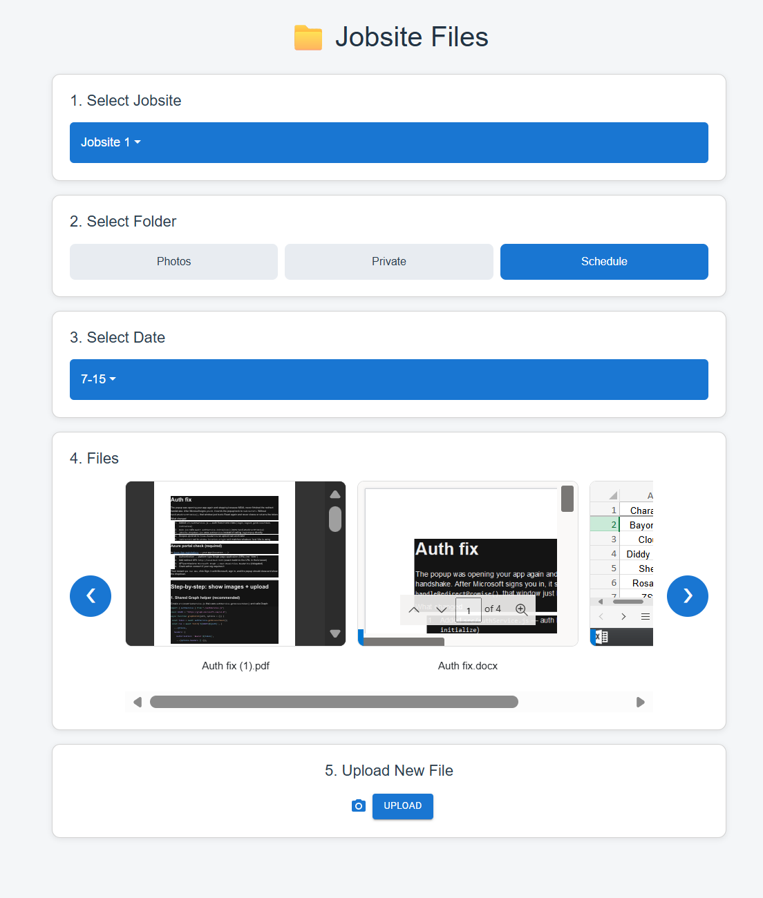

# Onedrive-SPA
A Microsoft 365–integrated web app for browsing and uploading jobsite documents straight from OneDrive/SharePoint — built for real-world use by an active company.

Designed and Built by Austin Thompson (github.com/thompson.ac) & Michael Cornelison (github.com/mariosoniczero)

## Description
Field and office teams often have jobsite photos, reports, and spreadsheets scattered across OneDrive folders. Jobsite Files gives them a single, clean interface to sign in with their Microsoft account and drill down from jobsite → folder → date to instantly view every file in that location — no downloading, no digging through the OneDrive web UI.

This project is being designed to be integrated into a real work environment designed for a specific company. It is made to integrating directly with their production Microsoft 365 environment.

## Highlights
Secure Microsoft sign-in using MSAL with a full-page redirect flow and a dedicated redirect-bridge page, wrapped in a reusable AuthService class that handles login, logout, and silent token refresh.
Live OneDrive/SharePoint integration via the Microsoft Graph API — jobsites, subfolders, and dates are all pulled dynamically from the user's drive.
Universal file previews — images and PDFs render inline, while Word, Excel, and PowerPoint files display through the Graph preview endpoint instead of force-downloading to the browser.
Horizontal gallery that loads every file in a folder at once and scrolls sideways for large sets.
Production-minded config — all tenant and client IDs live in environment variables, kept out of source control.

## Tech Stack
React 19 · Vite · @azure/msal-browser + @azure/msal-react · Microsoft Graph API · React-Bootstrap · MUI

## Example Photos

What We Learned
Because this was built for an actual company rather than a sandbox, We had to account for a real Microsoft 365 tenant, real permissions, and non-technical end users. The trickiest part was authentication: getting MSAL's popup/redirect handshake to complete reliably (including MSAL 5's redirect-bridge requirement and a Vite dependency-reload race) taught me a lot about the OAuth authorization-code flow for SPAs. On the data side, I learned to distinguish MSAL (identity + tokens) from Microsoft Graph (the actual file operations), and how to render Office documents without triggering downloads.

