# Onedrive-SPA
A Microsoft 365–integrated web app for browsing and uploading jobsite documents straight from OneDrive/SharePoint. Built for real-world use by an active company.

Designed and Built by:  
 [Austin Thompson](https://github.com/thompsonac4) & [Michael Cornelison](https://github.com/mariosoniczero)   

## Description
Field and office teams often have jobsite photos, reports, and spreadsheets scattered across OneDrive folders. Jobsite Files gives them a single, clean interface to sign in with their Microsoft account and drill down from jobsite → folder → date to instantly view every file in that location, no downloading, no digging through the OneDrive web UI.

This project is being designed to be integrated into a real work environment designed for a specific company. It is made to integrating directly with their production Microsoft 365 environment.

## Highlights
Secure Microsoft sign-in using MSAL with a full-page redirect flow and a dedicated redirect-bridge page, wrapped in a reusable AuthService class that handles login, logout, and silent token refresh.
Live OneDrive/SharePoint integration via the Microsoft Graph API — jobsites, subfolders, and dates are all pulled dynamically from the user's drive.
Universal file previews: images and PDFs render inline, while Word, Excel, and PowerPoint files display through the Graph preview endpoint instead of force-downloading to the browser.
Horizontal gallery that loads every file in a folder at once and scrolls sideways for large sets.
Production-minded config: all tenant and client IDs live in environment variables, kept out of source control.  

## Tech Stack
React 19 · Vite · @azure/msal-browser + @azure/msal-react · Microsoft Graph API · React-Bootstrap · MUI  

## Example Photos
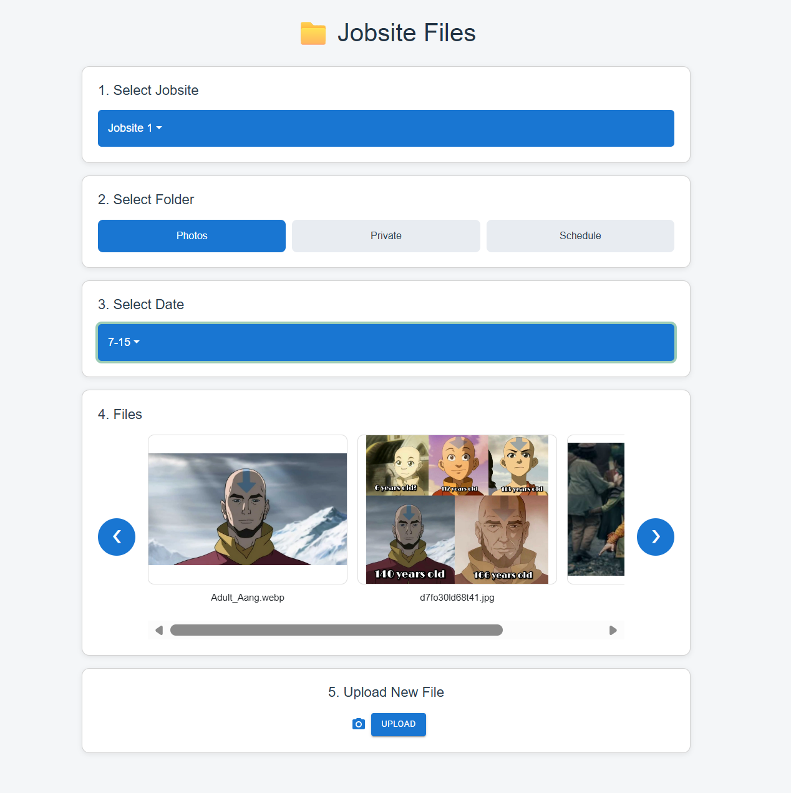 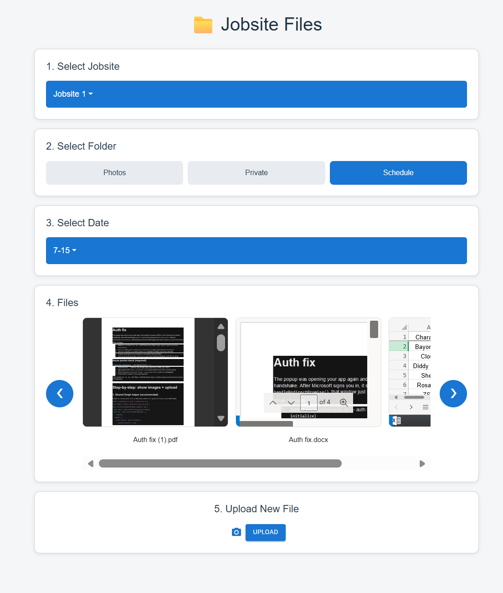  
# Review
What We Learned
Because this was built for an actual company rather than a sandbox, We had to account for a real Microsoft 365 tenant, real permissions, and non-technical end users. The trickiest part was authentication: getting MSAL's popup/redirect handshake to complete reliably (including MSAL 5's redirect-bridge requirement and a Vite dependency-reload race) taught me a lot about the OAuth authorization-code flow for SPAs. On the data side, I learned to distinguish MSAL (identity + tokens) from Microsoft Graph (the actual file operations), and how to render Office documents without triggering downloads.

<<<<<<< Updated upstream
=======
---


## Features & Functions

### 1. Microsoft sign-in (`login-button.jsx`, `authService.js`, `auth.html`)

Users sign in with their work Microsoft account. Auth uses MSAL’s redirect flow through `/auth.html`, then returns to the app. Tokens are refreshed silently for Graph calls.

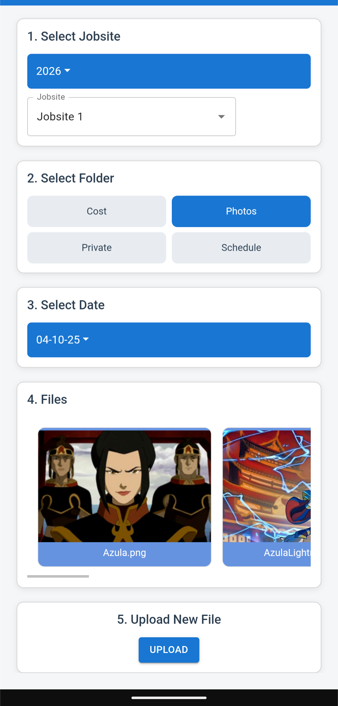

---

### 2. Browse year → jobsite → folder → date

| Step | UI | Source |
| --- | --- | --- |
| Year | Year dropdown | `year-dropdown.jsx` |
| Jobsite | Autocomplete dropdown | `jobsite-dropdown.jsx` |
| Subfolder | Tabs (Photos, docs, etc.) | `subfolder-tabs.jsx` |
| Date | Date dropdown | `date-dropdown.jsx` |

Paths are coordinated through `pathManager.js` and custom window events so each control stays in sync.


### 3. File gallery (`imagecontainer.jsx`, `filethumbnail.jsx`, `load-images.jsx`)

Once a date folder is selected, every file loads into a horizontal thumbnail strip. Files are classified by extension (image, video, PDF, Word, Excel, PowerPoint) and previewed accordingly.


### 4. Photo viewer (lightbox)

Click a photo thumbnail to open the full-screen viewer (`fileviewer.jsx` + `fileslide.jsx`). Navigate with on-screen arrows or keyboard (← → Esc). Images are loaded via Graph and shown inline.

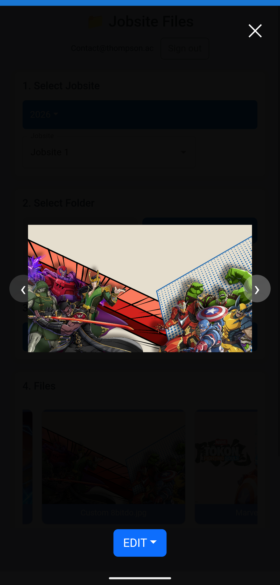

---

### 5. Video viewer (lightbox)

Videos use a streamable OneDrive/SharePoint download URL (not a full blob download), then play with native HTML5 controls in the same lightbox. Only one file is mounted at a time so playback stays stable next to Office previews.


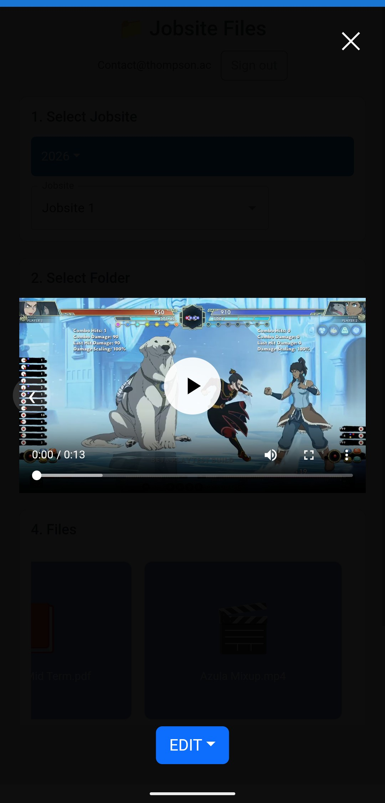

---

### 6. Office & PDF previews

PDFs and Office documents open through Microsoft Graph’s **preview** action and render in an iframe (Office Online–style viewer) instead of triggering a browser download.


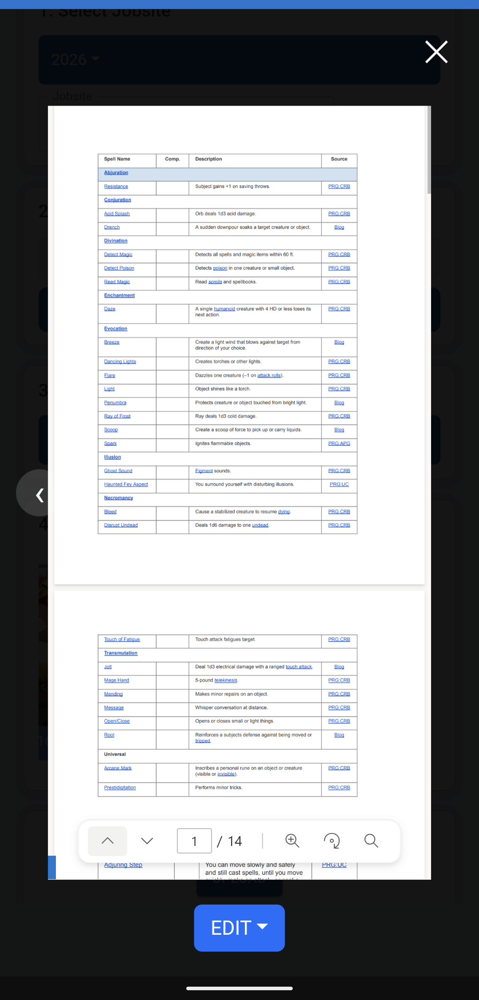
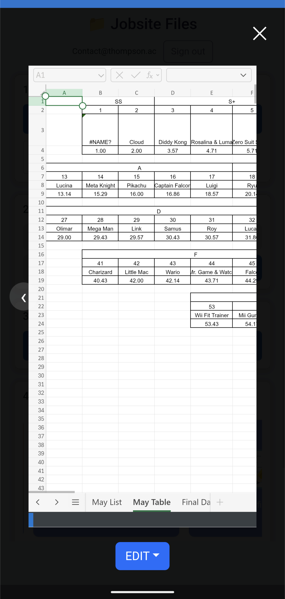

---

### 7. Upload files (`upload.jsx`, `upload-session.jsx`)

Users pick files, choose an existing date folder (or create one), and upload with progress and result modals.

- **Small files** → simple Graph `PUT …/content`
- **Large files** (e.g. videos) → `createUploadSession` + chunked upload with retries
- Several files can upload concurrently without one failure stopping the batch


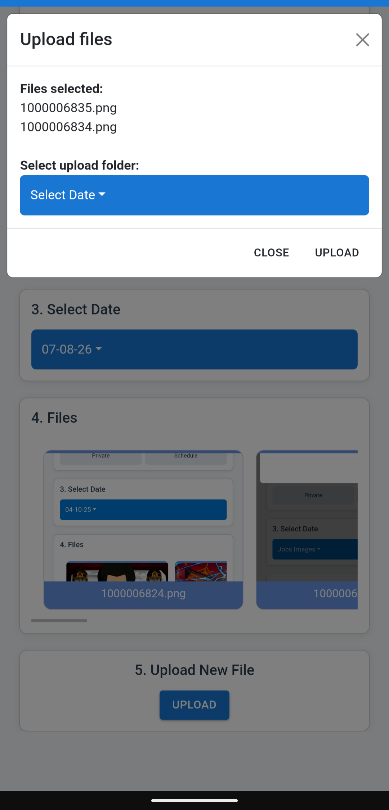

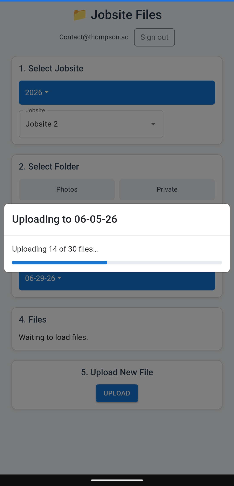


---

### 8. Create a new calendar date folder (`calendar-selection.jsx`, `create-folder.js`)

From the date dropdown or upload flow, **Add New Date** opens a calendar. Choosing a day builds a folder name (`MM-D-YY`) and creates that folder in OneDrive via Graph so uploads and browsing can target it immediately.


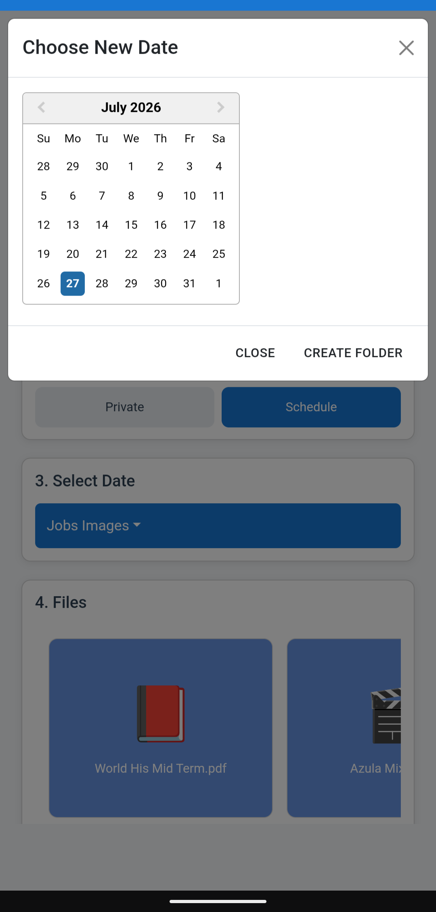


---

### 9. Delete files (`delete-item.js`, viewer + `App.jsx` confirmation)

From the file viewer, users can delete the current file. Graph deletes the drive item; the app shows a confirmation/status modal and refreshes the gallery.


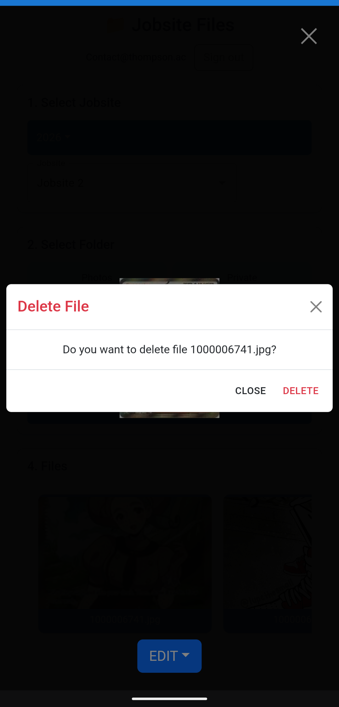

---

### 10. Rename files (`change-file-name.js`)

From the viewer edit controls, users can rename a file (extension preserved) via a Graph `PATCH` on the drive item.


---

## Module map (for developers)

| Area | Main files |
| --- | --- |
| App shell | `src/App.jsx`, `src/main.jsx` |
| Auth | `src/authService.js`, `src/login-button.jsx`, `src/msal-config.jsx`, `auth.html` |
| Navigation | `year-dropdown.jsx`, `jobsite-dropdown.jsx`, `subfolder-tabs.jsx`, `date-dropdown.jsx` |
| Paths / events | `src/pathmanager.js` |
| Gallery & viewer | `imagecontainer.jsx`, `filethumbnail.jsx`, `fileviewer.jsx`, `fileslide.jsx`, `load-images.jsx` |
| Upload | `upload.jsx`, `upload-session.jsx`, `date-selection.jsx` |
| New date folder | `calendar-selection.jsx`, `create-folder.js` |
| Delete / rename | `delete-item.js`, `change-file-name.js` |

Deeper notes: [`AUTH.md`](./AUTH.md) · [`UPLOAD.md`](./UPLOAD.md)

---

## Setup

1. Install dependencies:

   ```bash
   npm install
   ```

2. Create your environment file from the template and fill in your values:

   ```bash
   cp .env.example .env
   ```

   | Variable | Description |
   | --- | --- |
   | `VITE_MSAL_CLIENT_ID` | Azure Entra SPA app (client) ID |
   | `VITE_MSAL_AUTHORITY` | Login authority (`common` or your tenant ID) |
   | `VITE_DRIVE_ID` | Graph drive id holding the jobsite folders |
   | `VITE_JOBSITES_FOLDER_ID` | Drive item id of the jobsites parent folder |
   | `VITE_JOBSITES_FOLDER_PATH` | Optional friendly path fallback |

3. In the Azure portal, register a **Single-page application** and add the redirect URI `http://localhost:5173/auth.html` (add your production URL later). Grant delegated Graph permissions: `User.Read`, `Files.ReadWrite.All`, `Sites.ReadWrite.All`.

4. Run the dev server:

   ```bash
   npm run dev
   ```

---

## Deploy to Azure Static Web Apps (GitHub)

Reuse the same Entra SPA registration and add your production redirect URI.

### 1. Entra

Under **Authentication → Single-page application**, add:

```text
https://<your-app>.azurestaticapps.net/auth.html
```

Keep `http://localhost:5173/auth.html` for local development.

### 2. Push to GitHub

Push this repo (`.env` stays git-ignored). Do **not** commit real secrets.

### 3. Create the Static Web App

Azure Portal → **Static Web Apps** → Create → connect the GitHub repo.

| Setting | Value |
| --- | --- |
| App location | `/` (or `/azure-react` if the app is in a subfolder) |
| Api location | leave empty |
| Output location | `dist` |

### 4. Build-time environment variables

Vite bakes `VITE_*` values in at **build time**. In GitHub → **Settings → Secrets and variables → Actions**, add the same `VITE_*` keys as in `.env`, then pass them into the workflow build step.

### 5. Confirm after deploy

- Open the Static Web Apps URL and sign in (`/auth.html` → `/`)
- `public/staticwebapp.config.json` is copied into `dist` so routing and `auth.html` work correctly

---

## Review

### What We Learned

Because this was built for an actual company rather than a sandbox, we had to account for a real Microsoft 365 tenant, real permissions, and non-technical end users.

The trickiest part was **authentication**: getting MSAL’s popup/redirect handshake to complete reliably (including MSAL’s redirect-bridge requirement and a Vite dependency-reload race) taught us a lot about the OAuth authorization-code flow for SPAs.

On the data side, we learned to distinguish **MSAL** (identity + tokens) from **Microsoft Graph** (the actual file operations), and how to render Office documents and stream large videos without forcing brittle full-file downloads. Large uploads needed resumable upload sessions with sensible chunk sizes and retries so real jobsite videos survive flaky connections.

Shipping delete, rename, and calendar-driven date folders pushed the app from “viewer” to a day-to-day field tool — with UI flows that stay understandable for people who live in OneDrive, not in DevTools.

---
>>>>>>> Stashed changes
