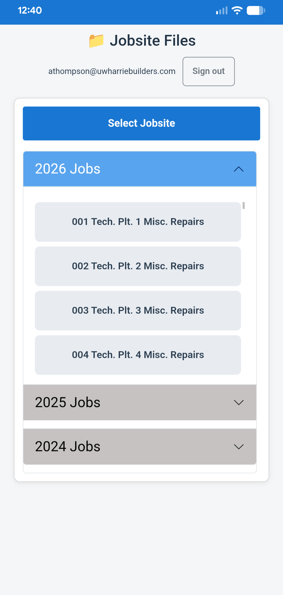
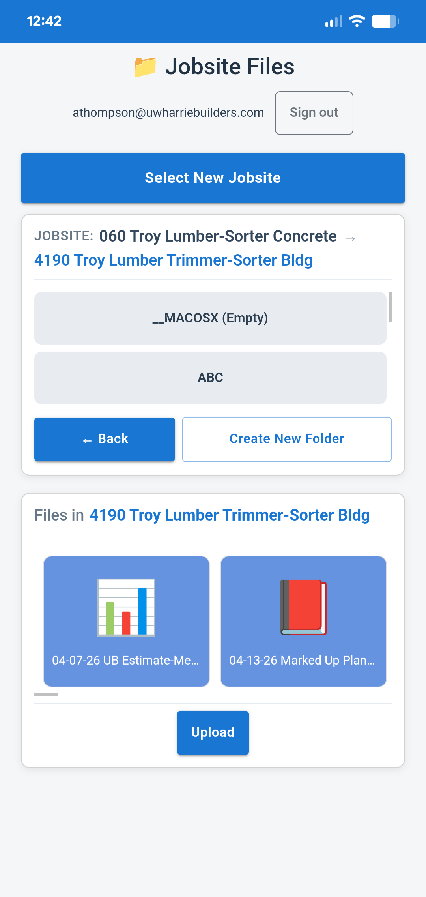
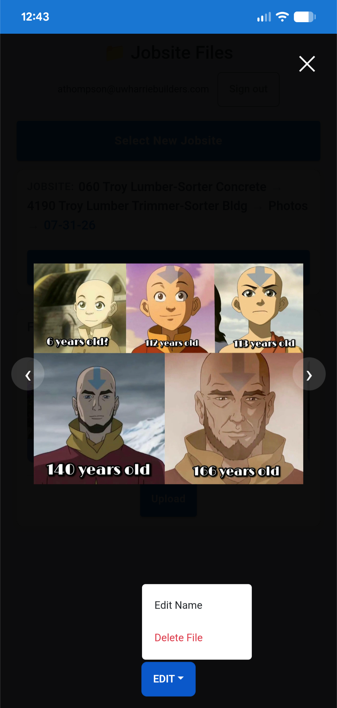
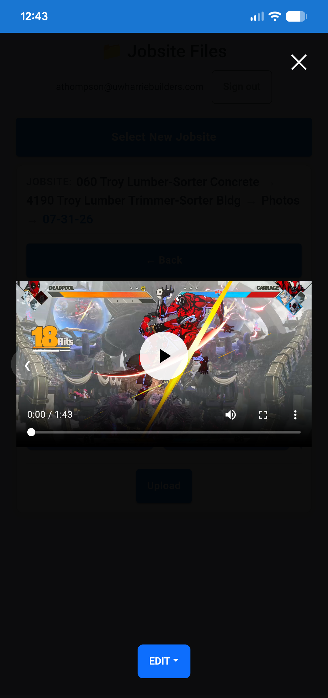
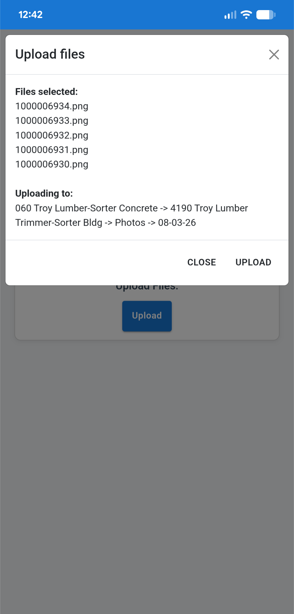
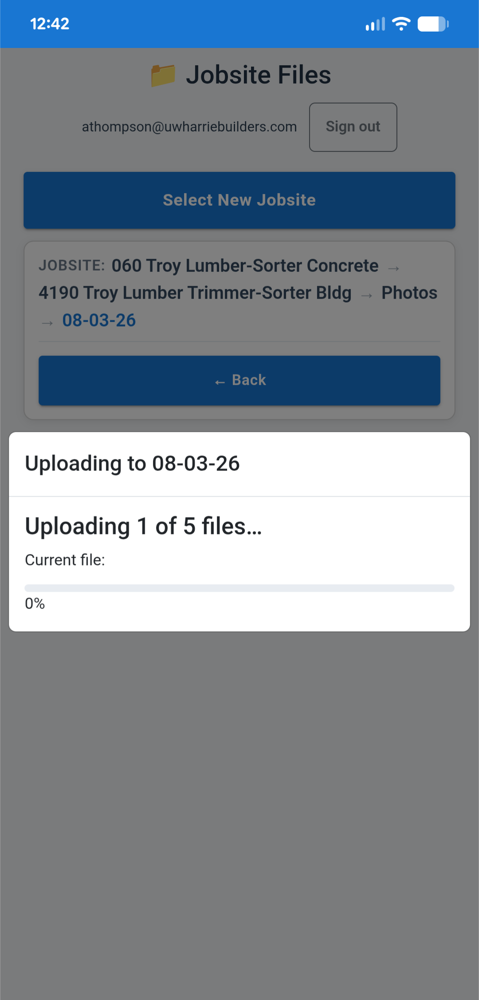
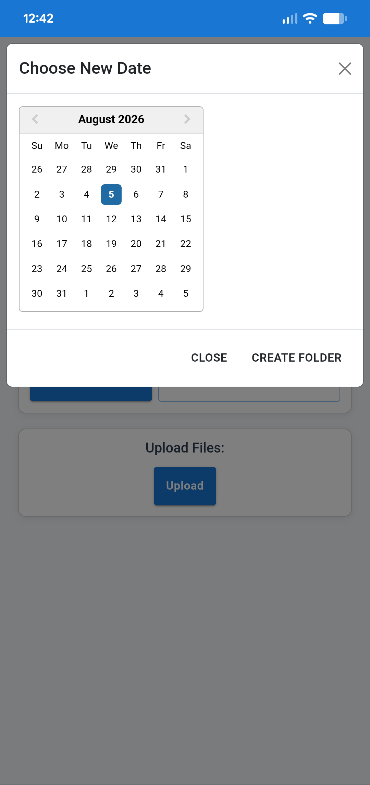
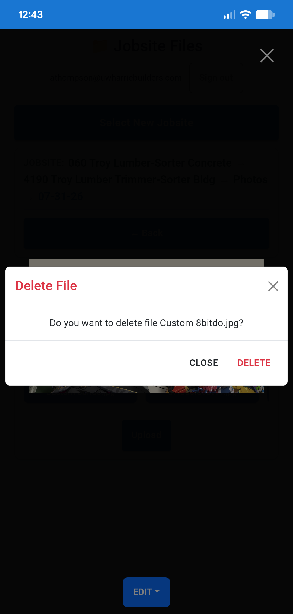
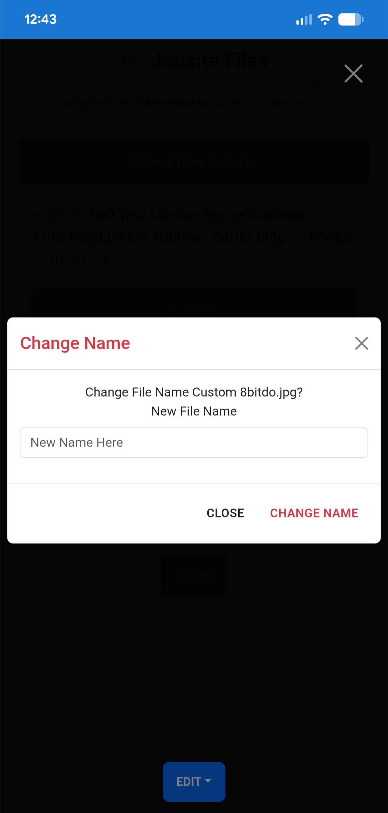

# Onedrive-SPA

A Microsoft 365–integrated web app for browsing and uploading jobsite documents straight from OneDrive/SharePoint. Built for real-world use by an active company.

**Designed and Built by:**  
[Austin Thompson](https://github.com/thompsonac4) & [Michael Cornelison](https://github.com/mariosoniczero)

---

## Description

Field and office teams often have jobsite photos, reports, and spreadsheets scattered across OneDrive folders. **Jobsite Files** gives them a single, touch-friendly interface to sign in with their Microsoft account, select a shared jobsite, browse its folders, and instantly view every file in that location — no digging through the OneDrive web UI for day-to-day work.

This project is designed for a real work environment and a specific company. It integrates directly with their production Microsoft 365 tenant (permissions, drive layout, and end-user workflows included).

The production drive may organize folders under inaccessible parents:

```text
Jobs
  └── 2026 Jobs
        ├── 2026-60  ← shared directly with a user
        └── 2026-32  ← shared directly with a user
              └── Subfolders
                    └── Files
```

Users do not need access to `Jobs` or `2026 Jobs`. The app opens each jobsite by its drive and item IDs from a curated catalog (`src/FolderIds/job-folder-ids.json`), then filters that list to jobs the signed-in user is permitted to see.

---

## Highlights

- **Secure Microsoft sign-in** using MSAL with a full-page redirect flow and a dedicated redirect-bridge page (`auth.html`), wrapped in a reusable `AuthService` class that handles login, logout, and silent token refresh.
- **Permission-filtered jobsite catalog** grouped by year — users only see jobsites shared with them (admins can see the full list).
- **Live OneDrive/SharePoint integration** via Microsoft Graph — nested folders and files load dynamically after a jobsite is selected.
- **Universal file previews:** images and videos render inline; PDFs and Word/Excel/PowerPoint use the Graph preview endpoint instead of force-downloading to the browser.
- **Horizontal gallery** that loads every file in a folder and scrolls sideways for large sets, with a full-screen lightbox for focused viewing.
- **Upload, create date folders, rename, and delete** without leaving the app (write permission required for upload and create).
- **Mobile-first navigation** with large controls, single-column full-width tabs (so long names fit), breadcrumb highlighting, bottom-left back navigation, and a full-width jobsite switch button.
- **Production-minded config:** all tenant and client IDs live in environment variables, kept out of source control.

---

## Tech Stack

React 19 · Vite 8 · `@azure/msal-browser` + `@azure/msal-react` · Microsoft Graph API · React-Bootstrap · MUI · React DatePicker · dayjs

---

## Interface

The current interface is designed for phones and tablets used in the field, including heavy browser zoom:

### Layout flow

1. **Sign in** — header login control  
2. **Select Jobsite** — year accordion → full-width jobsite tabs  
3. **Browse folders** — path breadcrumb, subfolder tabs, Back / Create New Folder  
4. **Files** — horizontal thumbnail strip when the folder has files  
5. **Upload** — sits directly under the carousel when files are visible (its own card only when there are no files yet)

### UI details

- **Jobsite tabs** are a single full-width column so long job names fit; the list scrolls after a few visible rows.
- **Subfolder tabs** are also single-column: two tabs show at once, then scroll/swipe for the rest.
- Empty child folders appear as `Name (Empty)`. If a folder has **no subfolders**, the tab list is hidden and the card stays tight — only **Back** and **Create New Folder** (when allowed).
- Tabs and action buttons use consistent, touch-friendly sizing; long labels wrap instead of truncating.
- The active folder is highlighted in blue in the path heading (`Jobsite: … → …`).
- **Select New Jobsite** is a large blue button above the folder content; it resets navigation and returns to jobsite selection.
- **Back** appears at the bottom-left only after entering a subfolder.
- **Create New Folder** remains at the bottom-right of the folder card (write permission required).
- File thumbnails scroll horizontally without making the page scroll sideways.







---

## Features & Functions

### 1. Microsoft sign-in (`login-button.jsx`, `authService.js`, `auth.html`)

Users sign in with their work Microsoft account. Auth uses MSAL’s redirect flow through `/auth.html`, then returns to the app. Tokens are refreshed silently for Graph calls.


---

### 2. Select a jobsite and browse folders

`jobsite-dropdown.jsx` loads jobsites from `src/FolderIds/job-folder-ids.json`, groups them by year in a Bootstrap accordion, and filters entries to those the signed-in user can access (matching Graph permission identities). Selecting a jobsite opens it directly through its item `id`, so the app never needs to traverse inaccessible parent folders.

`subfolder-tabs.jsx` then lists the selected folder’s children as full-width tabs. Write permission on the current folder (Graph `/permissions`) gates **Upload** and **Create New Folder**. If the current folder name looks like a date (`MM-DD-YY` / `MM/DD/YY`), the upload control is hidden at that level.

Navigation state is coordinated through `pathManager.js` and custom window events (`pathChanged`, `showFolder`, `showFiles`, `uploadPermissionChanged`, and related). The breadcrumb shows the current path, the bottom-left **Back** button returns to the previous folder, and **Select New Jobsite** resets the flow.


---

### 3. File gallery (`imagecontainer.jsx`, `filethumbnail.jsx`, `load-images.jsx`)

When the current folder contains files, every file loads into a horizontal thumbnail strip. Files are classified by extension (image, video, PDF, Word, Excel, PowerPoint) and previewed accordingly. The upload button appears in the same card, directly under the strip.

---

### 4. Photo viewer (lightbox)

Click a photo thumbnail to open the full-screen viewer (`fileviewer.jsx` + `fileslide.jsx`). Navigate with on-screen arrows, keyboard (← → Esc), or swipe. Images are loaded via Graph and shown inline.



---

### 5. Video viewer (lightbox)

Videos use a streamable OneDrive/SharePoint download URL (not a full blob download), then play with native HTML5 controls in the same lightbox. Only one file is mounted at a time so playback stays stable next to Office previews.



---

### 6. Office & PDF previews

PDFs and Office documents open through Microsoft Graph’s **preview** action and render in an iframe (Office Online–style viewer) instead of triggering a browser download.


---

### 7. Upload files (`upload.jsx`, `upload-session.jsx`)

Users with write permission can pick images and upload them into the current folder, with progress and result modals.

- **Small files** → simple Graph `PUT …/content`
- **Large files** (e.g. videos when allowed by the picker) → `createUploadSession` + chunked upload with retries
- Several files can upload concurrently without one failure stopping the batch

When files are already visible, the Upload control sits under the thumbnail carousel instead of in a separate card.

<p float="left">
   
   
</p>

---

### 8. Create a new calendar date folder (`calendar-selection.jsx`, `create-folder.js`)

The **Create New Folder** action is positioned at the bottom-right of the folder container (when the user has write permission). It opens a calendar where the user chooses a day. The app builds a folder name (`MM-DD-YY`) and creates it through Microsoft Graph so uploads and browsing can target it immediately.



---

### 9. Delete files (`delete-item.js`, viewer + `App.jsx` confirmation)

From the file viewer, users can delete the current file. Graph deletes the drive item; the app shows a confirmation/status modal and refreshes the gallery.



---

### 10. Rename files (`change-file-name.js`)

From the viewer edit controls, users can rename a file (extension preserved) via a Graph `PATCH` on the drive item.



---

## Module map (for developers)

| Area | Main files |
| --- | --- |
| App shell | `src/App.jsx`, `src/main.jsx` |
| Auth | `src/auth/` (`authService.js`, `login-button.jsx`, `msal-config.jsx`, `auth-redirect.js`) + root `auth.html` |
| Jobsite catalog | `src/FolderIds/job-folder-ids.json` |
| Navigation | `src/navigation/` (jobsite accordion/tabs, subfolder tabs, back navigation, calendar) |
| Paths / Graph helpers | `src/services/` (`pathmanager.js`, create/delete/rename, etc.) |
| Gallery & viewer | `src/files/` |
| Upload | `src/upload/` |
| Styles | `src/index.css`, `src/App.css`, `src/files/imagecontainer.css` |

Deeper notes: [`AUTH.md`](./AUTH.md) · [`UPLOAD.md`](./UPLOAD.md)

---

## Setup

1. Install dependencies:

   ```bash
   npm install
   ```

2. Create your environment file from the template and fill in your values:

   ```bash
   cp .env.example .env
   ```

   | Variable | Description |
   | --- | --- |
   | `VITE_MSAL_CLIENT_ID` | Azure Entra SPA app (client) ID |
   | `VITE_MSAL_AUTHORITY` | Login authority (`common` or your tenant ID) |
   | `VITE_DRIVE_ID` | Graph drive id holding the jobsite folders |
   | `VITE_JOBSITES_FOLDER_ID` | Drive item id of the jobsites parent folder |
   | `VITE_JOBSITES_FOLDER_PATH` | Optional friendly path fallback |

3. Keep `src/FolderIds/job-folder-ids.json` up to date with jobsite IDs and permission identities so the year accordion can filter correctly for each user.

4. In the Azure portal, register a **Single-page application** and add the redirect URI `http://localhost:5173/auth.html` (add your production URL later). Grant delegated Graph permissions: `User.Read`, `Files.ReadWrite.All`, `Sites.ReadWrite.All`.

5. Run the dev server:

   ```bash
   npm run dev
   ```

Other scripts: `npm run build` · `npm run preview` · `npm run lint`

---

## Deploy to Azure Static Web Apps (GitHub)

Reuse the same Entra SPA registration and add your production redirect URI.

### 1. Entra

Under **Authentication → Single-page application**, add:

```text
https://<your-app>.azurestaticapps.net/auth.html
```

Keep `http://localhost:5173/auth.html` for local development.

### 2. Push to GitHub

Push this repo (`.env` stays git-ignored). Do **not** commit real secrets.

### 3. Create the Static Web App

Azure Portal → **Static Web Apps** → Create → connect the GitHub repo.

| Setting | Value |
| --- | --- |
| App location | `/` (or `/azure-react` if the app is in a subfolder) |
| Api location | leave empty |
| Output location | `dist` |

### 4. Build-time environment variables

Vite bakes `VITE_*` values in at **build time**. In GitHub → **Settings → Secrets and variables → Actions**, add the same `VITE_*` keys as in `.env`, then pass them into the workflow build step.

### 5. Confirm after deploy

- Open the Static Web Apps URL and sign in (`/auth.html` → `/`)
- `public/staticwebapp.config.json` is copied into `dist` so routing and `auth.html` work correctly

---

## Review

### What We Learned

Because this was built for an actual company rather than a sandbox, we had to account for a real Microsoft 365 tenant, real permissions, and non-technical end users.

The trickiest part was **authentication**: getting MSAL’s popup/redirect handshake to complete reliably (including MSAL’s redirect-bridge requirement and a Vite dependency-reload race) taught us a lot about the OAuth authorization-code flow for SPAs.

On the data side, we learned to distinguish **MSAL** (identity + tokens) from **Microsoft Graph** (the actual file operations), and how to render Office documents and stream large videos without forcing brittle full-file downloads. Large uploads needed resumable upload sessions with sensible chunk sizes and retries so real jobsite videos survive flaky connections.

Shipping delete, rename, and calendar-driven date folders pushed the app from “viewer” to a day-to-day field tool — with UI flows that stay understandable for people who live in OneDrive, not in DevTools. Field use also drove the mobile layout: single-column tabs for readable names, a compact empty-folder footer, and upload placed next to the file carousel.
