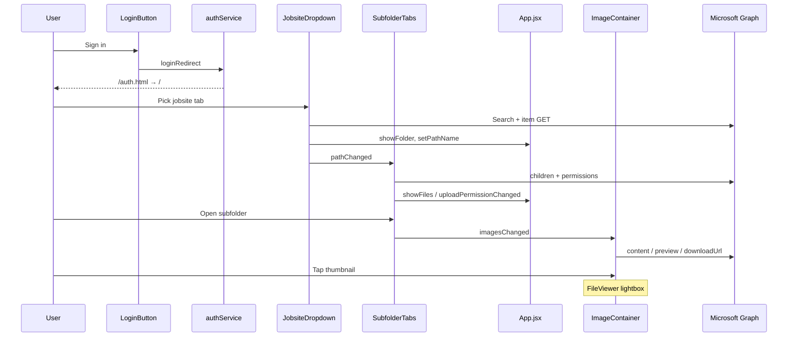

# Jobsite Files — Technical Writeup

A module-by-module breakdown of how this React SPA is built: authentication, navigation state, Microsoft Graph calls, the file gallery/lightbox, uploads, and the CSS/UI patterns that hold it together.

---

## 1. What this app is

**Jobsite Files** is a mobile-first Single Page Application that lets field and office users:

1. Sign in with a Microsoft work account (MSAL)
2. Discover jobsite folders shared with them (even when parent folders are inaccessible)
3. Browse nested folders as large touch tabs
4. Preview images, videos, PDFs, and Office docs inline
5. Upload, create date folders, rename, and delete files via Microsoft Graph

It is not a generic OneDrive browser. It is wired to a specific tenant layout (`YYYY-##` jobsite names, date folders like `MM-DD-YY`) and coordinated through a shared path singleton plus custom `window` events.

**Stack:** React 19 · Vite 8 · `@azure/msal-browser` / `@azure/msal-react` · Microsoft Graph · React-Bootstrap · MUI · react-datepicker

---

## 2. Project layout

```text
azure-react/
├── index.html              # Main SPA shell
├── auth.html               # MSAL redirect landing page (no React tree)
├── vite.config.js
├── public/staticwebapp.config.json
└── src/
    ├── main.jsx            # Boot: MSAL init → MsalProvider → App
    ├── App.jsx             # Layout + UI visibility via window events
    ├── App.css / index.css # Global + component styles
    ├── auth/               # Login, tokens, redirect bridge
    ├── navigation/         # Jobsite search, subfolder tabs, calendar
    ├── files/              # Gallery, thumbnails, lightbox
    ├── upload/             # Simple + chunked Graph uploads
    └── services/           # pathManager, CRUD helpers, sorting, logger
```

Path alias: `@` → `src/` (configured in Vite).

---

## 3. Build & HTML entry points

### 3.1 Vite config

Two HTML inputs so production builds include both the app and the auth bridge:

```js
// vite.config.js (excerpt)
export default defineConfig({
  resolve: { alias: { '@': resolve(__dirname, 'src') } },
  optimizeDeps: {
    include: [
      '@azure/msal-browser',
      '@azure/msal-browser/redirect-bridge',
      '@azure/msal-react',
    ],
  },
  build: {
    rollupOptions: {
      input: {
        main: resolve(__dirname, 'index.html'),
        auth: resolve(__dirname, 'auth.html'),
      },
    },
  },
});
```

`optimizeDeps.include` for the redirect-bridge matters: without it, Vite can hot-reload mid-login and break MSAL’s BroadcastChannel handshake.

### 3.2 `index.html` — app shell

Mounts React into `#root`, sets PWA/mobile meta (`apple-mobile-web-app-capable`, theme color `#1976d2`), and loads `/src/main.jsx`.

### 3.3 `auth.html` — auth-only page

Intentionally **not** the React app. It only shows “Signing in…” and loads `auth-redirect.js`. Entra’s SPA redirect URI must point here exactly (e.g. `https://host/auth.html`).

### 3.4 Azure Static Web Apps routing

```json
{
  "navigationFallback": {
    "rewrite": "/index.html",
    "exclude": ["/auth.html", "/assets/*", "/*.{css,js,...}"]
  },
  "routes": [{ "route": "/auth.html", "rewrite": "/auth.html" }]
}
```

SPA deep links fall back to `index.html`, but `/auth.html` is preserved so OAuth redirects still work.

---

## 4. Boot sequence (`main.jsx`)

```jsx
async function start() {
  const pca = await authService.initialize();

  createRoot(document.getElementById("root")).render(
    <MsalProvider instance={pca}>
      <App />
    </MsalProvider>
  );
}

start().catch((err) => { /* show error in #root */ });
```

Order matters:

1. `authService.initialize()` boots MSAL and runs `handleRedirectPromise()` (completes a login that returned through `auth.html`)
2. The same PCA instance is passed to `<MsalProvider>` so hooks like `useIsAuthenticated()` work
3. Only then does `App` render

---

## 5. Authentication layer

### 5.1 Config (`msal-config.jsx`)

All tenant values come from `VITE_*` env vars. Redirect URIs are derived from `window.location.origin` so local and production hosts stay correct:

```js
export const msalConfig = {
  auth: {
    clientId,                              // VITE_MSAL_CLIENT_ID
    authority,                             // tenant or /common
    redirectUri: `${origin}/auth.html`,
    postLogoutRedirectUri: `${origin}/auth.html`,
    navigateToLoginRequestUrl: false,
  },
  cache: { cacheLocation: "localStorage" },
};

export const loginRequest = {
  scopes: ["User.Read", "Files.ReadWrite.All", "Sites.ReadWrite.All"],
};
```

### 5.2 `AuthService` singleton

One shared MSAL client for the whole app:

| Method | Role |
| --- | --- |
| `initialize()` | `pca.initialize()` + `handleRedirectPromise()` + set active account |
| `login()` | `loginRedirect` (top-level) or `loginPopup` (inside iframe previewers) |
| `logout()` | Matching redirect/popup logout |
| `getAccessToken(scopes?)` | Silent token first; interactive redirect/popup if needed; **`null` = redirect in progress** |
| `isAuthenticated()` / `getAccount()` | Cache helpers |

Token pattern used everywhere before Graph:

```js
const token = await authService.getAccessToken();
if (!token) return; // redirect started — stop this request

await fetch(graphUrl, {
  headers: { Authorization: `Bearer ${token}` },
});
```

Silent acquisition:

```js
try {
  const silent = await this.pca.acquireTokenSilent({ scopes, account });
  return silent.accessToken;
} catch (err) {
  if (err instanceof InteractionRequiredAuthError) {
    await this.pca.acquireTokenRedirect({ scopes, account });
    return null;
  }
  throw err;
}
```

Stuck-login recovery clears `msal.interaction.status` from storage when redirect handling fails.

### 5.3 Redirect bridge (`auth-redirect.js`)

```js
import { broadcastResponseToMainFrame } from "@azure/msal-browser/redirect-bridge";

if (!hasAuthResponse) {
  window.location.replace("/"); // logout landing / empty visit
  return;
}

await broadcastResponseToMainFrame(); // cache response → navigate to /
```

Flow:

```text
User clicks Sign in
  → loginRedirect → Microsoft login
  → browser lands on /auth.html?code=...
  → broadcastResponseToMainFrame()
  → navigate to /
  → main.jsx initialize() → handleRedirectPromise() → account cached
```

### 5.4 Login UI (`login-button.jsx`)

- Signed out → “Sign in with Microsoft”
- Signed in → username + “Sign out”
- Inside an iframe / blocked popup → “Open in browser to sign in” (`target="_blank"`)
- Blocks login if `!window.isSecureContext` (MSAL needs HTTPS or localhost)

Uses `@azure/msal-react` for display state (`useIsAuthenticated`, `useMsal`) and `authService` for the actual redirect/popup calls.

---

## 6. App shell & visibility state (`App.jsx`)

`App` is the layout orchestrator. It does **not** own folder IDs; those live in `pathManager`. It owns which cards are visible and the breadcrumb text.

### 6.1 Selection flow (UI)

```text
Login (header)
  → showJobs:     JobsiteDropdown
  → showFolder:   SubfolderTabs + “Select New Jobsite”
  → showFiles:    ImageContainer
  → showUpload:   Upload (when write permission exists)
  → showingCalendar / deletion Modal as overlays
```

### 6.2 Event bus (custom `window` events)

Components are loosely coupled. Child modules dispatch events; `App` (and peers) listen in `useEffect` and update React state.

| Event | Typical source | Effect in App |
| --- | --- | --- |
| `showFolder` | Jobsite select | Hide jobs card, show folder card |
| `showJobs` | (reset path) | Show jobsite selection |
| `showFiles` / `hideFiles` | SubfolderTabs | Toggle gallery card |
| `setPathName` | Jobsite / subfolder select | Append breadcrumb segment |
| `folderBack` | SubfolderTabs Back | Pop last breadcrumb segment |
| `setFolderName` | Navigation | “Files in {name}” heading |
| `uploadPermissionChanged` | SubfolderTabs | Toggle upload card |
| `showCalendar` | Create New Folder | Open `CalendarSelection` |
| `deletionStatus` | FileViewer | Status modal after delete/rename |
| `pathChanged` | Jobsite / subfolder | SubfolderTabs reloads children |
| `imagesChanged` | Upload / delete / navigate | Gallery reloads |
| `dateAdded` | Calendar create | Refresh folder lists |

Listener pattern:

```jsx
useEffect(() => {
  function pathNameEvent(event) {
    setPathName((currentPath) => {
      const nextSegment = String(event.detail || "").trim();
      // dedupe last segment, strip "Jobsite:" prefix, join with " -> "
      ...
    });
  }
  window.addEventListener("setPathName", pathNameEvent);
  return () => window.removeEventListener("setPathName", pathNameEvent);
}, []);
```

### 6.3 Reset to jobsite picker

```js
function selectNewJobsite() {
  pathManager.Path = "";
  pathManager.folderId = "";
  pathManager.clearFolderHistory();
  setShowJobs(true);
  setShowFolder(false);
  setShowFiles(false);
  // ...
}
```

### 6.4 Breadcrumb HTML

Path segments are rendered so the **current** folder is highlighted blue:

```jsx
<h2 className="path-heading">
  <span className="path-heading-label">Jobsite:</span>
  {pathSegments.map((segment, index) => (
    <>
      {index > 0 && <span className="path-separator">→</span>}
      <span className={index === pathSegments.length - 1
        ? "path-segment path-segment-current"
        : "path-segment"}>
        {segment}
      </span>
    </>
  ))}
</h2>
```

---

## 7. Shared navigation state (`pathmanager.js`)

Singleton that every module imports. Acts as the “current location” for Graph URLs without prop-drilling.

```js
class PathManager {
  constructor() {
    if (!this.instance) {
      this.path = "";
      this._folderId = "";
      this._folderName = "";
      this._filePath = "";   // base URL used for uploads
      this._IdArray = [];    // back-stack of { id, name }
      this.instance = this;
    }
    return this.instance;
  }

  addId(id, name = "") { this._IdArray.push({ id, name }); }
  getLastFolder() { return this._IdArray.pop() || null; }
  canGoBack() { return this._IdArray.length > 0; }
  clearFolderHistory() { this._IdArray = []; }
}

const pathManager = new PathManager();
export default pathManager;
```

**Back navigation:** before entering a child folder, `SubfolderTabs` pushes the current `{id, name}` onto `_IdArray`. Back pops it and redispatches `pathChanged` / `folderBack`.

---

## 8. Navigation modules

### 8.1 Jobsite discovery (`jobsite-dropdown.jsx`)

**Problem:** Users often have a jobsite folder shared directly (`2026-60`) without access to parents (`Jobs` → `2026 Jobs`). Listing by path fails. Search by item + open by `driveId`/`id` works.

**Graph call:** Microsoft Search API

```js
await fetch("https://graph.microsoft.com/v1.0/search/query", {
  method: "POST",
  headers: {
    Authorization: `Bearer ${accessToken}`,
    "Content-Type": "application/json",
  },
  body: JSON.stringify({
    requests: [{
      entityTypes: ["driveItem"],
      query: { queryString: "(FileName:19* OR FileName:20*)" },
      from: 0,
      size: 500,
      fields: ["id", "name", "folder", "parentReference", "webUrl"],
    }],
  }),
});
```

**Post-processing:**

1. Keep hits matching `/^\d{4}\s*-\s*.+/` (e.g. `2026-60`)
2. Refresh each hit with `GET /drives/{driveId}/items/{id}` (search index can lag renames)
3. Dedupe by normalized name
4. Group by year → Bootstrap `Accordion` of years, each with two-column `Tabs`

**On select:**

```js
pathManager.folderId = folder.id;
pathManager.folderName = folder.name;
pathManager.Path = `https://graph.microsoft.com/v1.0/drives/${driveId}/items/${id}/children`;

window.dispatchEvent(new CustomEvent("pathChanged"));
window.dispatchEvent(new CustomEvent("showFolder"));
window.dispatchEvent(new CustomEvent("setPathName", { detail: folder.name }));
```

Tab UI uses empty `<Tab>` bodies — tabs are pure selectors, not panels:

```jsx
<Tabs activeKey={selectedFolder} onSelect={handleSelect} className="jobsite-tabs" fill>
  {jobs.map((folder) => (
    <Tab
      key={`${folder.driveId}:${folder.id}`}
      eventKey={`${folder.driveId}:${folder.id}`}
      title={folder.displayName}
    />
  ))}
</Tabs>
```

### 8.2 Subfolder tabs (`subfolder-tabs.jsx`)

Loads children of `pathManager.folderId` from the configured drive:

```js
const url = `https://graph.microsoft.com/v1.0/drives/${driveID}/items/${pathManager.folderId}/children`;
```

For each child folder it also fetches *that* folder’s children to mark empty ones (`displayName: "Name (Empty)"`). Sorted via `sortFoldersByName` (date folders newest-first).

**Side effects of `loadFolders`:**

- Files present → `showFiles`; none → `hideFiles`
- Checks Graph `/permissions` for a `write` role → `uploadPermissionChanged`
- Date-folder name pattern (`MM/DD/YY`) forces upload UI off at that level (upload targets the date folder itself via other wiring)

**Footer interactions:**

| Control | Handler |
| --- | --- |
| ← Back | `pathManager.getLastFolder()` + redispatches |
| Create New Folder | `showCalendar` with detail `"SubfolderTabs"` |

### 8.3 Calendar → create date folder

`calendar-selection.jsx` uses `react-datepicker` inline. Selected day → `MM-DD-YY` string:

```js
const newDateString = date
  .toLocaleDateString("en-us", { month: "2-digit", day: "2-digit", year: "2-digit" })
  .replaceAll("/", "-");
```

`CreateFolder` POSTs to Graph:

```js
const driveItem = {
  name: folderName,
  folder: {},
  "@microsoft.graph.conflictBehavior": "fail",
};

await fetch(
  `https://graph.microsoft.com/v1.0/drives/${driveID}/items/${pathManager.folderId}/children`,
  {
    method: "POST",
    headers: {
      Authorization: `Bearer ${accessToken}`,
      "Content-Type": "application/json",
    },
    body: JSON.stringify(driveItem),
  }
);
```

Then dispatches `dateAdded` / `folderChanged` so tabs reload.

### 8.4 Folder name sorting (`folder-name-sort.js`)

Date folders (`07-30-26`) sort chronologically (newest first). Other names sort alphabetically with numeric awareness (`localeCompare` + `numeric: true`).

### 8.5 Legacy / alternate nav

`year-dropdown.jsx`, `date-dropdown.jsx`, and `date-selection.jsx` implement an older path-based hierarchy (Projects → year → dates). Current `App.jsx` drives discovery through Search + `SubfolderTabs`; those files remain for upload destination / historical flows.

---

## 9. File gallery & lightbox

### 9.1 Classification (`imagecontainer.jsx`)

```js
function classify(name) {
  const extension = name.split(".").pop().toLowerCase();
  if (["jpg", "jpeg", "png", ...].includes(extension)) return "image";
  if (["mp4", "webm", "mov", ...].includes(extension)) return "video";
  if (extension === "pdf") return "pdf";
  if (["doc", "docx"].includes(extension)) return "word";
  // excel, powerpoint, or "unknown"
}
```

### 9.2 Loading strategy

1. `fetchImageNames` → list children of current folder
2. Split into images / videos / documents; sort each group by name
3. Load in parallel with different Graph strategies:

| Type | How content is obtained |
| --- | --- |
| Image | `GET .../items/{id}/content` → `blob` → `URL.createObjectURL` |
| Video | Item metadata → `@microsoft.graph.downloadUrl` (streamable, range requests) |
| PDF / Office | `POST .../items/{id}/preview` → embeddable `getUrl` for iframe |

```js
// Video — do NOT blob the whole file
item.url = await fetchVideoUrl(driveId, file.id);

// Office / PDF — Office Online–style viewer
item.url = await fetchPreviewUrl(driveId, file.id);
// getUrl + "&wdAr=1"
```

Gallery order rendered: images, then documents, then videos.

### 9.3 Thumbnail strip HTML

```jsx
<div className="thumbnail-strip">
  {files.map((file, index) => (
    <FileThumbnail
      key={file.id}
      file={file}
      onClick={() => {
        setActiveIndex(index);
        setViewerOpen(true);
      }}
    />
  ))}
</div>
```

`FileThumbnail`: real `` for images; emoji icon tiles for other types; filename truncated with CSS ellipsis.

### 9.4 Lightbox (`fileviewer.jsx` + `fileslide.jsx`)

Full-viewport overlay (`.viewer`). One file mounted at a time (`key={file.id}`) so video/iframe state does not leak between slides.

**`FileSlide` rendering:**

```jsx
switch (file.type) {
  case "image": return ;
  case "video": return <video src={file.url} controls playsInline preload="metadata" />;
  case "pdf":
  case "word":
  case "excel":
  case "powerpoint":
    return <iframe src={file.url} className="document-viewer" />;
  default: return <h2>Cannot Preview</h2>;
}
```

**Interactions:**

| Input | Behavior |
| --- | --- |
| ← / → keys | Previous / next file |
| Esc | Close |
| On-screen ‹ › | Previous / next |
| Pointer swipe | Horizontal delta ≥ 56px; ignored on `video`/`iframe`/buttons/modals |
| EDIT dropdown | Rename or Delete |

Rename preserves extension:

```js
const ext = name.substring(name.lastIndexOf(".") + 1);
const next = `${newName}.${ext}`;
await ChangeFileName(itemUrl, next); // Graph PATCH { name }
```

Delete:

```js
await DeleteItem(`https://graph.microsoft.com/v1.0/drives/${driveId}/items/${id}`);
// Graph DELETE → imagesChanged + deletionStatus → App modal
```

---

## 10. Uploads

### 10.1 UI flow (`upload.jsx`)

1. Hidden `<input type="file" multiple>` triggered by MUI “Upload” button  
2. Selection modal lists filenames + destination path  
3. Progress modal (`backdrop="static"`, `keyboard={false}`) — cannot dismiss mid-upload  
4. Result modal: Success / Partial / Failed  

### 10.2 Small vs large files

```js
if (file.size <= LARGE_FILE_SIZE) {
  // Simple upload
  await fetch(`${pathManager.filePath}:/${encodeURIComponent(file.name)}:/content`, {
    method: "PUT",
    body: file,
    headers: {
      Authorization: `Bearer ${accessToken}`,
      "Content-Type": file.type || "application/octet-stream",
    },
  });
} else {
  const uploadUrl = await createUploadSession(pathManager.filePath, file.name, accessToken);
  await uploadLargeFile(file, uploadUrl, onProgress);
}
```

Each `uploadOne` **catches** errors and returns `{ name, ok }` so one failure does not abort the batch.

### 10.3 Concurrency pool

```js
const CONCURRENCY = 4;
const queue = [...files];

const worker = async () => {
  while (queue.length > 0) {
    const file = queue.shift();
    const result = await uploadOne(file, accessToken);
    if (!result.ok) failed.push(result.name);
    done += 1;
    setProgress({ done, total: files.length });
  }
};

await Promise.all(
  Array.from({ length: Math.min(CONCURRENCY, files.length) }, worker)
);

window.dispatchEvent(new CustomEvent("imagesChanged")); // once at the end
```

### 10.4 Chunked session (`upload-session.jsx`)

Graph rules: chunk size multiple of 320 KiB (except last). This app uses **3.2 MiB** chunks with up to **4 retries** and exponential backoff on 408/429/5xx / “Failed to fetch”.

```js
await fetch(uploadUrl, {
  method: "PUT",
  headers: {
    "Content-Length": String(chunk.size),
    "Content-Range": `bytes ${start}-${end - 1}/${totalSize}`,
  },
  body: chunk,
});
// 202 = more chunks; 200/201 = complete
```

Session creation:

```js
POST `${folderPath}:/${encodeURIComponent(fileName)}:/createUploadSession`
body: { item: { "@microsoft.graph.conflictBehavior": "replace" } }
→ { uploadUrl }
```

---

## 11. Graph helper services

| File | Verb | Purpose |
| --- | --- | --- |
| `oneDriveService.js` | GET/PUT | Thin wrappers: list children, blob URL, simple upload |
| `create-folder.js` | POST | New child folder under `pathManager.folderId` |
| `delete-item.js` | DELETE | Drive item by URL |
| `change-file-name.js` | PATCH | `{ name }` on drive item |
| `handleDriveId.jsx` | GET `/me/drive` | Resolve personal drive id (legacy helper) |
| `load-images.jsx` | GET/POST | Names, blobs, preview URLs, video download URLs |
| `load-folders.jsx` | GET | Folder names only |
| `logger.js` | PUT | Batched per-user `applog-*.txt` on the drive (~2 min flush) |

`graphFetch` pattern in `oneDriveService.js`:

```js
async function graphFetch(path, options = {}) {
  const token = await authService.getAccessToken();
  const res = await fetch(`https://graph.microsoft.com/v1.0${path}`, {
    ...options,
    headers: { Authorization: `Bearer ${token}`, ...(options.headers || {}) },
  });
  if (!res.ok) throw new Error(`Graph ${res.status}: ${await res.text()}`);
  return res;
}
```

---

## 12. HTML structure (composition)

Conceptual DOM once a user is deep in a jobsite:

```html
<div class="container">
  <div class="app-header">
    <h1>Jobsite Files</h1>
    <div class="login-area">…</div>
  </div>

  <!-- optional: jobsite accordion + tabs -->

  <div class="jobsite-nav-bar">
    <button>Select New Jobsite</button>
  </div>

  <section class="card">
    <h2 class="path-heading">Jobsite: … → current</h2>
    <div class="SubfolderTabs">
      <ul class="nav-tabs">…folder tabs…</ul>
      <div class="subfolder-footer">
        <button>← Back</button>
        <button>Create New Folder</button>
      </div>
    </div>
  </section>

  <section class="card">
    <h2 class="files-heading">Files in <span class="files-heading-folder">…</span></h2>
    <div class="ImageContainer">
      <div class="thumbnail-strip">…thumbnails…</div>
    </div>
  </section>

  <section class="card upload">…</section>
</div>

<!-- portals: Bootstrap Modals, fullscreen .viewer -->
```

Lightbox is `position: fixed; inset: 0` with `z-index` high enough to cover the app; edit modals bump even higher (`.modal { z-index: 1000000 }`).

---

## 13. CSS & design system

### 13.1 Design tokens (`index.css`)

Shared touch sizes so tabs and buttons feel consistent on phones:

```css
:root {
  --control-height: 52px;
  --control-font: 16px;
  --control-padding: 12px 22px;
  --tab-height: 64px;
  --tab-font: 17px;
  --tab-gap: 10px;
  --jobsite-tab-height: 76px;
  --jobsite-tab-font: 19px;
}
```

Breakpoints shrink these at 768 / 640 / 380 px.

### 13.2 Layout rules

- Page never scrolls sideways (`overflow-x: hidden` on `html, body`); only `.thumbnail-strip` scrolls horizontally
- Cards: white, 12px radius, light shadow on `#f4f6f8` page background
- Primary brand blue: `#1976d2` (active tabs, headings, progress bar, theme-color)
- Jobsite / folder tabs: two-column grid (`flex: 0 0 calc(50% - gap/2)`), max ~3 rows then vertical scroll
- Current breadcrumb / “Files in” folder name: `.path-segment-current` / `.files-heading-folder` → blue

### 13.3 Gallery & viewer (`imagecontainer.css`)

```css
.thumbnail-strip {
  display: flex;
  flex-wrap: nowrap;
  overflow-x: auto;
  gap: 15px;
}

.viewer {
  position: fixed;
  width: 100vw;
  height: 100vh;
  background: rgba(0, 0, 0, 0.95);
  touch-action: pan-y; /* prefer vertical browser scroll; horizontal = swipe */
}
```

Nav arrows are circular semi-transparent buttons; close is absolute top-right.

### 13.4 Unified control sizing

One rule so Bootstrap buttons, MUI buttons, and tab links share height/padding:

```css
.card .btn,
.card .MuiButton-root,
.modal-footer .btn,
.login-area .btn {
  min-height: var(--control-height);
  padding: var(--control-padding);
  font-size: var(--control-font);
  font-weight: 600;
}
```

---

## 14. End-to-end interaction map



---

## 15. Mental model (building blocks)

| Building block | Responsibility |
| --- | --- |
| **MSAL + auth.html** | Who the user is; Bearer tokens |
| **Microsoft Graph** | All file/folder data and mutations |
| **pathManager** | Current folder id/name/upload base URL + back stack |
| **CustomEvent bus** | Cross-component communication without a global store |
| **App.jsx** | Which cards/modals are on screen + breadcrumb |
| **JobsiteDropdown** | Search-based entry into shared jobs |
| **SubfolderTabs** | Drill-down navigation + permission gating |
| **ImageContainer / FileViewer** | Load, classify, preview, edit files |
| **Upload + upload-session** | Concurrent small PUTs + resumable large uploads |
| **CSS variables + cards** | Touch-first, consistent field UI |

If you are extending the app, the usual pattern is: update `pathManager` → call Graph with `authService.getAccessToken()` → dispatch the matching `window` event so listeners refresh UI.
